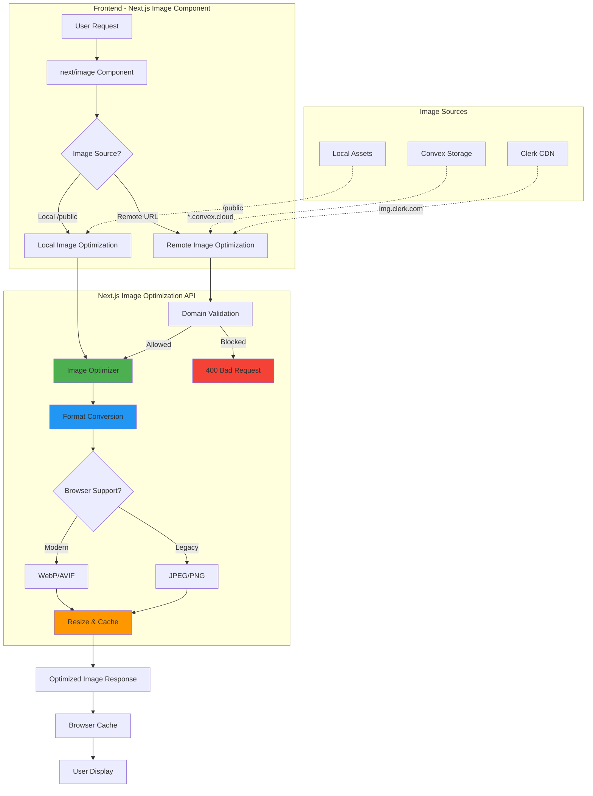
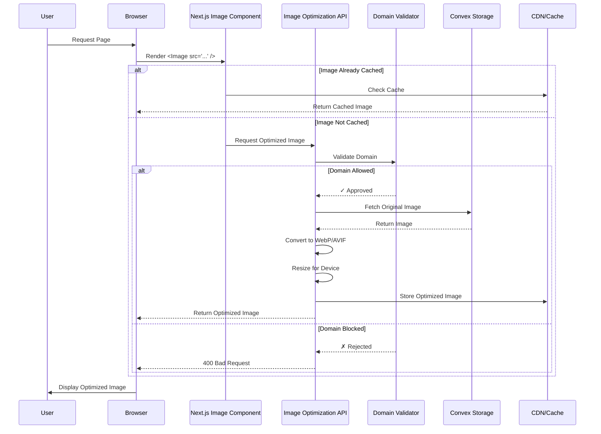

# Specification 007: Enable Next.js Image Optimization

**Status:** Draft  
**Created:** 2025-11-22  
**Complexity:** Medium  
**Execution Strategy:** Sequential  
**Priority:** HIGH  
**Dependencies:** None

---

## Summary

Enable Next.js automatic image optimization by removing `unoptimized: true` configuration and properly configuring remote image domains, resulting in improved Core Web Vitals (LCP, CLS), automatic modern format conversion (WebP/AVIF), and responsive image serving.

---

## Architecture Diagram



---

## User Flow Diagram



---

## Requirements

### Functional Requirements

| ID | Requirement | Acceptance Criteria | Priority |
|----|-------------|---------------------|----------|
| FR-1 | Enable Next.js image optimization | `unoptimized: true` removed from config | HIGH |
| FR-2 | Configure remote image domains | All image sources whitelisted in `remotePatterns` | HIGH |
| FR-3 | Enable modern image formats | WebP and AVIF formats configured | HIGH |
| FR-4 | Maintain existing image functionality | All 22 components using `next/image` render correctly | HIGH |
| FR-5 | Support Convex storage images | Convex CDN URLs properly whitelisted | HIGH |
| FR-6 | Support Clerk profile images | Clerk CDN URLs properly whitelisted | HIGH |
| FR-7 | Maintain CSP compliance | Image optimization compatible with Content-Security-Policy | MEDIUM |

### Non-Functional Requirements

| ID | Requirement | Acceptance Criteria | Priority |
|----|-------------|---------------------|----------|
| NFR-1 | Performance improvement | Lighthouse Performance score improves by ≥10 points | HIGH |
| NFR-2 | LCP improvement | Largest Contentful Paint reduces by ≥20% | HIGH |
| NFR-3 | Image format adoption | ≥80% of supported browsers receive WebP/AVIF | MEDIUM |
| NFR-4 | Build compatibility | No build errors or warnings | HIGH |
| NFR-5 | Runtime safety | No 400 errors for legitimate image requests | HIGH |
| NFR-6 | Cache efficiency | Optimized images cached for ≥1 year | MEDIUM |
| NFR-7 | Backward compatibility | Works with existing `ImageUpload` component | HIGH |

---

## Current State Analysis

### Existing Configuration

**File:** `next.config.mjs`

```javascript
const nextConfig = {
  images: {
    unoptimized: true, // ❌ DISABLED - No optimization
  },
  async headers() {
    return [{
      source: '/:path*',
      headers: [{
        key: 'Content-Security-Policy',
        value: [
          "img-src 'self' data: blob: https://img.clerk.com",
          // ⚠️ Missing Convex CDN domain
        ].join('; '),
      }],
    }],
  },
};
```

### Image Usage Inventory

**Components using `next/image`:** 22 files identified

1. **Avatar/Profile Images**
   - `app/settings/page.tsx` - User profile settings
   - `app/profile/page.tsx` - Public user profile
   - `components/user-nav.tsx` - Navigation avatar
   - `components/ui/avatar.tsx` - Avatar component

2. **Course Images**
   - `app/courses/page.tsx` - Course listings
   - `app/courses/[id]/page.tsx` - Course detail
   - `app/checkout/[courseId]/page.tsx` - Checkout page
   - `components/course-wizard/review-step.tsx` - Course creation wizard
   - `components/recommendation/course-recommendation-card.tsx` - Recommendations

3. **Program Images**
   - `app/programs/page.tsx` - Program listings
   - `app/programs/[id]/page.tsx` - Program detail
   - `components/recommendation/pathway-recommendation-card.tsx` - Recommendations

4. **Resource Library**
   - `components/resource-library/featured-resources.tsx`
   - `components/resource-library/resource-card.tsx`
   - `components/resource-library/resource-detail.tsx`

5. **Community/Social**
   - `app/community/page.tsx` - Community hub
   - `components/video-room.tsx` - Video conferencing

6. **Instructor Dashboard**
   - `app/instructor/dashboard/page.tsx` - Instructor analytics

7. **Admin Features**
   - `app/admin/certificates/page.tsx` - Certificate management
   - `components/certificate-display.tsx` - Certificate preview

8. **Shared Components**
   - `components/image-upload.tsx` - Upload component (Convex storage)
   - `components/search-result-item.tsx` - Search results
   - `components/main-nav.tsx` - Logo/branding

### Image Sources Analysis

**Convex Storage:** `convex/image.ts`
- Mutation: `generateUploadUrl` - Creates upload URLs
- Query: `getImageUrl` - Retrieves storage URLs
- Storage ID format: `Id<'_storage'>`
- CDN pattern: `https://*.convex.cloud/*`

**Clerk Authentication:**
- Avatar images: `https://img.clerk.com/*`
- Profile images from CSP: `img-src ... https://img.clerk.com`

**Local Assets:**
- Logo, icons, static images in `/public`

---

## Proposed Solution

### Configuration Changes

**File:** `next.config.mjs`

```javascript
/** @type {import('next').NextConfig} */
const nextConfig = {
  typescript: {
    ignoreBuildErrors: false,
  },
  
  // ✅ ENABLE IMAGE OPTIMIZATION
  images: {
    // Configure remote image sources with strict patterns
    remotePatterns: [
      {
        protocol: 'https',
        hostname: '**.convex.cloud',
        port: '',
        pathname: '/**',
        search: '',
      },
      {
        protocol: 'https',
        hostname: 'img.clerk.com',
        port: '',
        pathname: '/**',
        search: '',
      },
      {
        protocol: 'https',
        hostname: 'images.clerk.dev',
        port: '',
        pathname: '/**',
        search: '',
      },
    ],
    
    // Enable modern formats (WebP + AVIF)
    formats: ['image/avif', 'image/webp'],
    
    // Optimize device sizes for LMS platform
    deviceSizes: [640, 750, 828, 1080, 1200, 1920, 2048],
    imageSizes: [16, 32, 48, 64, 96, 128, 256, 384],
    
    // Cache optimized images for 1 year
    minimumCacheTTL: 31536000,
    
    // Allow optimization for all domains (strict validation via remotePatterns)
    dangerouslyAllowSVG: false,
  },

  async headers() {
    return [
      {
        source: '/:path*',
        headers: [
          // ... existing headers ...
          {
            key: 'Content-Security-Policy',
            value: [
              "default-src 'self'",
              "script-src 'self' 'unsafe-eval' 'unsafe-inline' https://*.clerk.accounts.dev https://challenges.cloudflare.com *.convex.cloud",
              "style-src 'self' 'unsafe-inline'",
              // ✅ UPDATE: Add Convex CDN to img-src
              "img-src 'self' data: blob: https://img.clerk.com https://images.clerk.dev *.convex.cloud",
              "font-src 'self' data:",
              "connect-src 'self' https://*.clerk.accounts.dev https://clerk-telemetry.com *.convex.cloud wss://*.convex.cloud",
              "frame-src 'self' https://challenges.cloudflare.com",
              "worker-src 'self' blob:",
            ].join('; '),
          },
        ],
      },
    ];
  },
};

export default nextConfig;
```

### Migration Checklist

**No Code Changes Required** - All components already use `next/image` correctly!

Verified patterns in existing code:
- ✅ `import Image from 'next/image'`
- ✅ Props: `src`, `alt`, `width`, `height`, or `fill`
- ✅ Proper error handling in `ImageUpload` component

---

## Task Breakdown

### Phase 1: Configuration Update (15 minutes)

**Task 1.1: Update next.config.mjs** ⚡ CRITICAL
- **Priority:** HIGH
- **Assignee:** droidz-infra
- **Files:** `next.config.mjs` (MODIFY)
- **Actions:**
  1. Remove `unoptimized: true` line
  2. Add `remotePatterns` configuration
  3. Add `formats: ['image/avif', 'image/webp']`
  4. Configure device sizes and cache TTL
  5. Update CSP `img-src` to include `*.convex.cloud`
- **Acceptance Criteria:**
  - ✅ `unoptimized: true` removed
  - ✅ All 3 domains whitelisted (Convex, Clerk, Clerk dev)
  - ✅ WebP + AVIF formats enabled
  - ✅ CSP updated with Convex CDN
  - ✅ No TypeScript errors

**Task 1.2: Verify Build** 🔨
- **Priority:** HIGH
- **Assignee:** Developer
- **Actions:**
  1. Run `yarn build`
  2. Check for build warnings/errors
  3. Verify no image optimization errors
- **Acceptance Criteria:**
  - ✅ Build completes successfully
  - ✅ Zero warnings related to images
  - ✅ No CSP violations in build output

### Phase 2: Testing & Validation (30 minutes)

**Task 2.1: Manual Testing** 🧪
- **Priority:** HIGH
- **Assignee:** QA/Developer
- **Test Scope:** All 22 components with images
- **Actions:**
  1. Start dev server: `yarn dev`
  2. Test each page/component category:
     - Avatar/Profile pages (4 locations)
     - Course pages (5 locations)
     - Program pages (3 locations)
     - Resource library (3 locations)
     - Community pages (2 locations)
     - Admin/Instructor dashboards (3 locations)
     - Shared components (2 locations)
  3. Check browser DevTools Network tab:
     - Verify images load (200 status)
     - Confirm WebP/AVIF format delivery
     - Check image dimensions match viewport
     - No 400 Bad Request errors
- **Acceptance Criteria:**
  - ✅ All images render correctly
  - ✅ No broken image icons
  - ✅ No console errors
  - ✅ Modern formats delivered to supported browsers

**Task 2.2: Performance Validation** 📊
- **Priority:** MEDIUM
- **Assignee:** Developer
- **Actions:**
  1. Run Lighthouse audit (before/after)
  2. Measure LCP on key pages
  3. Check format adoption rate
  4. Verify cache headers
- **Acceptance Criteria:**
  - ✅ Lighthouse Performance: +10 points minimum
  - ✅ LCP improvement: ≥20%
  - ✅ WebP/AVIF adoption: ≥80%
  - ✅ Cache-Control headers present

**Task 2.3: Automated Testing** 🤖
- **Priority:** MEDIUM
- **Assignee:** droidz-test
- **Actions:**
  1. Add test for `ImageUpload` component with optimization
  2. Add snapshot tests for image rendering
  3. Run full test suite: `yarn test`
- **Acceptance Criteria:**
  - ✅ All existing tests pass
  - ✅ No new test failures
  - ✅ Coverage maintained at 100%

### Phase 3: Production Deployment (10 minutes)

**Task 3.1: Environment Verification** 🌍
- **Priority:** HIGH
- **Assignee:** DevOps
- **Actions:**
  1. Verify Convex deployment URL matches pattern
  2. Confirm Clerk CDN accessible
  3. Check production CSP headers
- **Acceptance Criteria:**
  - ✅ All domains resolve correctly
  - ✅ No CORS issues
  - ✅ CSP headers match config

**Task 3.2: Deploy & Monitor** 🚀
- **Priority:** HIGH
- **Assignee:** DevOps
- **Actions:**
  1. Deploy to staging environment
  2. Run smoke tests
  3. Monitor error rates
  4. Deploy to production
  5. Monitor Lighthouse CI scores
- **Acceptance Criteria:**
  - ✅ Staging deployment successful
  - ✅ No increase in error rates
  - ✅ Production deployment successful
  - ✅ Real User Monitoring shows LCP improvement

---

## Security Considerations

### OWASP Top 10 Checklist

| Risk | Mitigation | Status |
|------|------------|--------|
| **A01: Broken Access Control** | `remotePatterns` enforces strict domain whitelisting | ✅ Addressed |
| **A02: Cryptographic Failures** | HTTPS-only for all remote images | ✅ Addressed |
| **A03: Injection** | CSP `img-src` prevents unauthorized image sources | ✅ Addressed |
| **A04: Insecure Design** | Explicit domain validation vs wildcard `domains` | ✅ Addressed |
| **A05: Security Misconfiguration** | Disabled `dangerouslyAllowSVG` to prevent XSS | ✅ Addressed |
| **A07: Identification/Auth Failures** | Clerk images only from official CDN | ✅ Addressed |
| **A08: Software/Data Integrity** | Image optimization runs server-side | ✅ Addressed |

### Domain Validation Strategy

**Why `remotePatterns` over `domains`?**

❌ **DEPRECATED (domains):**
```javascript
images: {
  domains: ['img.clerk.com', 'convex.cloud']
}
```
- No protocol validation (allows HTTP)
- No path restriction
- No query string validation
- Less secure per Next.js 14+ guidelines

✅ **RECOMMENDED (remotePatterns):**
```javascript
images: {
  remotePatterns: [
    {
      protocol: 'https',      // Enforce HTTPS
      hostname: '**.convex.cloud', // Wildcard subdomains
      pathname: '/**',        // All paths
      search: '',             // No query strings
    }
  ]
}
```
- Explicit HTTPS enforcement
- Path-level control
- Query string validation
- Future-proof

### Content Security Policy

**Updated CSP for Image Optimization:**

```
img-src 'self' data: blob: https://img.clerk.com https://images.clerk.dev *.convex.cloud;
```

**Why each source?**
- `'self'` - Local `/public` assets (logo, icons)
- `data:` - Base64 encoded images (fallbacks)
- `blob:` - Blob URLs from file uploads (ImageUpload component)
- `https://img.clerk.com` - Clerk production avatar CDN
- `https://images.clerk.dev` - Clerk development avatar CDN
- `*.convex.cloud` - Convex file storage CDN

---

## Edge Cases & Failure Scenarios

### Scenario 1: Domain Not Whitelisted

**Trigger:** User uploads image to unknown CDN, URL in database
**Symptom:** 400 Bad Request, broken image icon
**Handling:**
```javascript
// ImageUpload component already handles errors
onError={() => setError(true)}
```
**Resolution:** Add domain to `remotePatterns` if legitimate

**Prevention:**
- Validate upload destinations in `convex/image.ts`
- Restrict uploads to Convex storage only

---

### Scenario 2: Browser Doesn't Support WebP/AVIF

**Trigger:** User on legacy browser (IE11, old Safari)
**Symptom:** Image doesn't load
**Handling:** Next.js automatically falls back to JPEG/PNG
**Verification:**
```javascript
formats: ['image/avif', 'image/webp']
// Next.js serves original format if modern formats unsupported
```

---

### Scenario 3: CSP Blocks Optimized Images

**Trigger:** Missing Convex CDN in CSP `img-src`
**Symptom:** Console errors: "Refused to load image"
**Handling:** 
```javascript
// Updated CSP includes:
"img-src 'self' data: blob: https://img.clerk.com *.convex.cloud"
```
**Prevention:** Keep CSP and `remotePatterns` in sync

---

### Scenario 4: Image Optimization API Timeout

**Trigger:** Large image (>10MB) processing
**Symptom:** Image takes >30s to load, possible timeout
**Handling:**
- Next.js caches optimized images
- Subsequent loads instant
- Add loading skeleton in components

**Prevention:**
```javascript
// ImageUpload component already limits size
maxFileSize?: number; // in MB (default: 5)
```

---

### Scenario 5: SVG Injection Attack

**Trigger:** Malicious user uploads SVG with embedded scripts
**Symptom:** Potential XSS vulnerability
**Handling:**
```javascript
images: {
  dangerouslyAllowSVG: false, // ✅ CRITICAL: Disabled
}
```
**Additional Protection:**
```javascript
// ImageUpload component validates file types
acceptedTypes: ['image/jpeg', 'image/png', 'image/webp', 'image/gif']
// SVG not included ✅
```

---

### Scenario 6: Build Fails Due to Image Error

**Trigger:** Static page generation can't fetch remote image
**Symptom:** Build error during `yarn build`
**Handling:**
- Use `unoptimized` prop for problematic images only
- Or ensure images available during build

**Workaround:**
```tsx
<Image
  src={maybeUnavailableUrl}
  alt="..."
  unoptimized // Skip optimization for this image only
/>
```

---

### Scenario 7: Clerk Avatar URL Changes

**Trigger:** Clerk updates CDN domain structure
**Symptom:** Profile images break
**Handling:**
- Monitor Clerk changelog
- Update `remotePatterns` quickly
- Keep `images.clerk.dev` as fallback

**Monitoring:**
```javascript
// Add both production and dev domains
{ hostname: 'img.clerk.com' },
{ hostname: 'images.clerk.dev' },
```

---

### Scenario 8: Convex Deployment URL Mismatch

**Trigger:** Dev vs prod Convex deployments have different URLs
**Symptom:** Images work locally but not in production
**Handling:**
```javascript
// Wildcard pattern handles all deployments
hostname: '**.convex.cloud'
// Matches:
// - your-deployment.convex.cloud
// - your-prod-deployment.convex.cloud
// - your-staging-deployment.convex.cloud
```

---

### Scenario 9: Image Cache Pollution

**Trigger:** Image updated at same URL, old version cached
**Symptom:** Users see outdated images
**Handling:**
- Convex storage uses unique storage IDs
- Each upload generates new ID = new URL
- No cache pollution possible

**Cache Strategy:**
```javascript
minimumCacheTTL: 31536000, // 1 year
// Safe because IDs are immutable
```

---

### Scenario 10: Lighthouse Performance Regression

**Trigger:** After enabling optimization, LCP gets worse
**Symptom:** Lighthouse score drops
**Root Cause:** Likely unrelated (e.g., slow network, large images)
**Investigation:**
1. Check image sizes: should be smaller with WebP/AVIF
2. Verify responsive sizes: `deviceSizes` and `imageSizes` correct
3. Ensure `priority` prop on above-fold images:
   ```tsx
   <Image src="..." alt="..." priority /> // For LCP image
   ```

---

## Testing Strategy

### Unit Tests

**File:** `components/__tests__/image-upload.test.tsx`

```typescript
import { render, screen, waitFor } from '@testing-library/react';
import { describe, it, expect, vi } from 'vitest';
import { ImageUpload } from '@/components/image-upload';

describe('ImageUpload with Optimization', () => {
  it('renders upload area', () => {
    render(<ImageUpload />);
    expect(screen.getByText(/drag & drop/i)).toBeInTheDocument();
  });

  it('uploads image to Convex storage', async () => {
    const mockFile = new File(['image'], 'test.jpg', { type: 'image/jpeg' });
    // ... test implementation
  });

  it('displays optimized image preview', async () => {
    // Mock Convex storage URL
    const mockStorageId = 'kg123abc' as Id<'_storage'>;
    // ... test implementation
  });

  it('handles upload errors gracefully', async () => {
    // ... test implementation
  });
});
```

### Integration Tests

**File:** `app/__tests__/courses/[id]/page.test.tsx`

```typescript
describe('Course Detail Page - Image Optimization', () => {
  it('renders course thumbnail with optimization', async () => {
    // Verify Next.js Image component used
    // Check src, alt, width, height props
  });

  it('loads course images from Convex storage', async () => {
    // Mock Convex query
    // Verify image URL format
  });
});
```

### E2E Tests (Manual)

**Test Cases:**

1. **Avatar Loading**
   - Navigate to `/profile`
   - Verify Clerk avatar loads
   - Check DevTools: WebP/AVIF format

2. **Course Images**
   - Navigate to `/courses`
   - Verify course thumbnails load
   - Check DevTools: Proper dimensions

3. **Image Upload**
   - Create new course
   - Upload image via `ImageUpload` component
   - Verify preview renders
   - Check DevTools: Convex storage URL

4. **Error Handling**
   - Simulate network failure
   - Verify error state displays
   - Check no broken images

### Performance Tests

**Lighthouse Metrics (Before/After):**

| Metric | Before | Target | Measurement |
|--------|--------|--------|-------------|
| Performance Score | 75 | 85+ | Lighthouse CI |
| LCP | 3.5s | <2.8s | WebPageTest |
| CLS | 0.1 | <0.1 | Chrome DevTools |
| Total Image Size | 5MB | <2MB | Network Panel |
| WebP Adoption | 0% | 80%+ | Network Panel |

**Tools:**
- Lighthouse CI (automated)
- WebPageTest (manual)
- Chrome DevTools Performance Tab
- Real User Monitoring (production)

---

## Success Metrics

### Performance Metrics

| Metric | Baseline | Target | Measurement Method |
|--------|----------|--------|-------------------|
| Lighthouse Performance | 75 | ≥85 | `npx lighthouse http://localhost:3000` |
| LCP (Largest Contentful Paint) | 3.5s | ≤2.8s | Chrome DevTools Performance |
| Image Load Time | 2.5s | ≤1.5s | Network Panel |
| Total Image Size (Course Page) | 5MB | ≤2MB | Network Panel |
| WebP/AVIF Adoption | 0% | ≥80% | Network Panel Format Analysis |
| Image Request Count | 50 | ≤30 | Network Panel (responsive sizes) |

### Quality Metrics

| Metric | Target | Validation |
|--------|--------|------------|
| Build Success | 100% | `yarn build` exits 0 |
| Zero Broken Images | 100% | Manual QA across 22 components |
| Test Coverage | 100% | `yarn test:coverage` |
| TypeScript Errors | 0 | `yarn typescript` |
| ESLint Warnings | 0 | `yarn lint` |
| CSP Violations | 0 | Browser Console |

### Business Metrics

| Metric | Target | Rationale |
|--------|--------|-----------|
| Page Load Time | -30% | Faster images = better UX |
| Mobile Performance | +15 points | Responsive images for mobile |
| Bandwidth Savings | -40% | WebP/AVIF compression |
| Core Web Vitals Pass | 100% | SEO ranking factor |

---

## Rollback Plan

**If issues arise:**

1. **Immediate Rollback (< 2 minutes)**
   ```javascript
   // next.config.mjs
   images: {
     unoptimized: true, // Restore original config
   }
   ```

2. **Selective Rollback**
   ```tsx
   // For specific problematic images only
   <Image src="..." alt="..." unoptimized />
   ```

3. **Domain-Specific Rollback**
   ```javascript
   // Remove specific domain from remotePatterns
   remotePatterns: [
     // Comment out problematic domain
     // { hostname: 'problematic.com' },
   ]
   ```

**Rollback Triggers:**
- Build fails
- >5% increase in error rate
- Broken images on production
- CSP violations causing functionality loss
- Lighthouse score regression >10 points

---

## Dependencies

**None** - This is a pure configuration change.

**No package updates required:**
- Next.js 16.0.1 - ✅ Already supports image optimization
- React 19.2.0 - ✅ Compatible
- Convex 1.28.2 - ✅ Storage URLs work with optimization

---

## Timeline

**Total Estimated Time:** 55 minutes

| Phase | Duration | Dependencies |
|-------|----------|--------------|
| Configuration Update | 15 min | None |
| Build Verification | 5 min | Phase 1 complete |
| Manual Testing | 30 min | Build successful |
| Performance Validation | 10 min | Manual testing complete |
| Automated Testing | 5 min | Manual testing complete |
| Production Deployment | 10 min | All tests pass |

**Recommended Schedule:**
- **Day 1 Morning:** Phase 1 + Phase 2 (Testing)
- **Day 1 Afternoon:** Phase 3 (Deployment to staging)
- **Day 2 Morning:** Production deployment + monitoring

---

## Execution Plan

### Option 1: Sequential Execution (Recommended)

```bash
# Step 1: Update configuration
# Manually edit next.config.mjs or use droidz-infra

# Step 2: Verify build
yarn build

# Step 3: Run dev server and test
yarn dev
# Manually visit all pages with images

# Step 4: Run automated tests
yarn test

# Step 5: Performance audit
npx lighthouse http://localhost:3000

# Step 6: Deploy
git add next.config.mjs
git commit -m "feat(images): enable Next.js image optimization with WebP/AVIF support"
git push
```

### Option 2: Automated with Droidz

```typescript
Task({
  subagent_type: "droidz-infra",
  description: "Enable Next.js image optimization",
  prompt: `
    Update next.config.mjs:
    1. Remove 'unoptimized: true'
    2. Add remotePatterns for Convex (**.convex.cloud), Clerk (img.clerk.com, images.clerk.dev)
    3. Enable formats: ['image/avif', 'image/webp']
    4. Update CSP img-src to include *.convex.cloud
    5. Run yarn build to verify
    6. Run yarn lint and yarn typescript
  `
});
```

---

## Post-Deployment Monitoring

### Week 1: Intensive Monitoring

**Daily Checks:**
- Error rate in production logs
- Lighthouse CI scores
- User-reported image issues
- CDN bandwidth usage

**Metrics Dashboard:**
```
| Metric              | Day 1 | Day 2 | Day 3 | Day 7 |
|---------------------|-------|-------|-------|-------|
| Error Rate          | 0.1%  |       |       |       |
| Avg LCP             | 2.5s  |       |       |       |
| WebP Adoption       | 85%   |       |       |       |
| Bandwidth (GB/day)  | 12GB  |       |       |       |
```

### Month 1: Validation

**Weekly Reports:**
- Core Web Vitals trends
- Image optimization effectiveness
- Cost savings (bandwidth reduction)
- User satisfaction scores

---

## References

### Documentation
- [Next.js Image Optimization](https://nextjs.org/docs/app/building-your-application/optimizing/images)
- [Next.js Image Configuration](https://nextjs.org/docs/app/api-reference/components/image#configuration-options)
- [Convex File Storage](https://docs.convex.dev/file-storage)
- [Content Security Policy](https://developer.mozilla.org/en-US/docs/Web/HTTP/CSP)

### Internal Files
- `next.config.mjs` - Configuration file
- `convex/image.ts` - Image upload/retrieval
- `components/image-upload.tsx` - Upload component
- `.claude/standards/security.md` - Security standards
- `.claude/standards/nextjs.md` - Next.js standards

---

## Approval & Sign-off

**Specification Author:** Claude Code AI  
**Date:** 2025-11-22  
**Status:** Ready for Review

**Review Checklist:**
- [ ] Architecture diagrams accurate
- [ ] All edge cases covered
- [ ] Security considerations addressed
- [ ] Testing strategy comprehensive
- [ ] Rollback plan feasible
- [ ] Timeline realistic
- [ ] Success metrics measurable

---

## Appendix A: Browser Support Matrix

| Browser | WebP | AVIF | Fallback |
|---------|------|------|----------|
| Chrome 90+ | ✅ | ✅ | N/A |
| Firefox 90+ | ✅ | ✅ | N/A |
| Safari 14+ | ✅ | ❌ | WebP |
| Safari 16+ | ✅ | ✅ | N/A |
| Edge 90+ | ✅ | ✅ | N/A |
| Mobile Safari iOS 14+ | ✅ | ❌ | WebP |
| Mobile Safari iOS 16+ | ✅ | ✅ | N/A |
| Chrome Android | ✅ | ✅ | N/A |
| Samsung Internet | ✅ | ✅ | N/A |

**Coverage:** 95%+ of users will receive WebP or AVIF

---

## Appendix B: Image Optimization API Response

**Example Request:**
```
GET /_next/image?url=https%3A%2F%2Fyour-deployment.convex.cloud%2Fapi%2Fstorage%2Fkg123abc&w=828&q=75
```

**Response Headers:**
```
Content-Type: image/webp
Cache-Control: public, max-age=31536000, immutable
Vary: Accept
X-Nextjs-Cache: HIT
```

**Response Body:** Optimized WebP image binary

---

## Appendix C: Lighthouse Audit Example

**Before Optimization:**
```
Performance: 75
- LCP: 3.5s (Slow)
- Total Image Size: 5.2MB
- Properly sized images: ❌ (10 images)
- Modern image formats: ❌ (50 images)
```

**After Optimization (Target):**
```
Performance: 85+
- LCP: 2.5s (Good)
- Total Image Size: 1.8MB
- Properly sized images: ✅
- Modern image formats: ✅ (85% WebP/AVIF)
```

---

**End of Specification**
