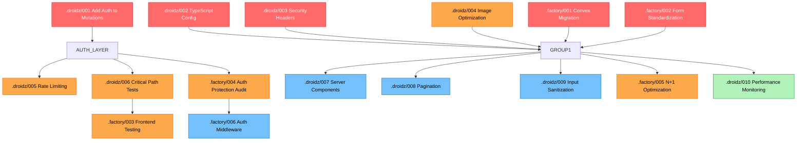

# Master Execution Plan: All Specifications Dependency Analysis

**Generated:** 2025-11-20  
**Total Specifications:** 16 (10 from .droidz + 6 from .factory)  
**Estimated Total Time:** 25-30 days sequential | 50-60 hours parallel (10-12x speedup)  
**Recommended Approach:** ⚡ **PARALLEL EXECUTION WITH ORCHESTRATOR**

---

## 📊 Specification Sources Overview

### **Source 1: `.droidz/specs/` (10 specs)**

- **Focus:** Security vulnerabilities, performance issues
- **Origin:** Codebase security audit
- **Priority:** CRITICAL security fixes
- **Numbering:** 001-010

### **Source 2: `.factory/specs/active/` (6 specs)**

- **Focus:** Standards compliance, architecture patterns
- **Origin:** Standards compliance audit
- **Priority:** Architecture + performance improvements
- **Numbering:** 001-006

---

## 🔍 Conflict Analysis

### **OVERLAP DETECTED: Authentication**

| Spec                 | Source           | Focus                       | Priority |
| -------------------- | ---------------- | --------------------------- | -------- |
| `.droidz/specs/001`  | Security Audit   | **Add auth to mutations**   | CRITICAL |
| `.factory/specs/004` | Compliance Audit | **Audit route protection**  | MEDIUM   |
| `.factory/specs/006` | Performance      | **Auth middleware pattern** | MEDIUM   |

**Resolution:**

1. **Execute `.droidz/001` FIRST** (auth in Convex mutations)
2. **Then `.factory/004`** (route protection audit)
3. **Then `.factory/006`** (refactor to custom functions)

### **OVERLAP DETECTED: Testing**

| Spec                 | Source     | Focus                            |
| -------------------- | ---------- | -------------------------------- |
| `.droidz/specs/006`  | Security   | Write tests for auth flows       |
| `.factory/specs/003` | Compliance | Frontend testing (80%+ coverage) |

**Resolution:**

- **Execute `.droidz/006` FIRST** (critical auth tests)
- **Then `.factory/003`** (comprehensive frontend testing)

### **OVERLAP DETECTED: TypeScript**

| Spec                | Source   | Focus                         |
| ------------------- | -------- | ----------------------------- |
| `.droidz/specs/002` | Security | Fix `ignoreBuildErrors: true` |

**Resolution:**

- **Execute `.droidz/002` EARLY** (blocks other work if type errors exist)

---

## 🎯 Dependency Graph (All 16 Specs)



---

## 📋 Master Dependency Table

| Spec ID                                  | Name                   | Priority    | Dependencies | Blocks            | Can Parallel With      | Status |
| ---------------------------------------- | ---------------------- | ----------- | ------------ | ----------------- | ---------------------- | ------ |
| **WAVE 1: Foundation (No Dependencies)** |                        |             |              |                   |
| D002                                     | TypeScript Config      | 🔴 CRITICAL | None         | All (type safety) | D003, D004, F001, F002 | DONE   |
| D003                                     | Security Headers       | 🔴 CRITICAL | None         | None              | D002, D004, F001, F002 | DONE   |
| D004                                     | Image Optimization     | 🟡 HIGH     | None         | None              | D002, D003, F001, F002 |
| F001                                     | Convex Migration       | 🔴 CRITICAL | None         | None              | D002, D003, D004, F002 |
| F002                                     | Form Standardization   | 🔴 CRITICAL | None         | None              | D002, D003, D004, F001 |
| **WAVE 2: Auth Foundation**              |                        |             |              |                   |
| D001                                     | Add Auth to Mutations  | 🔴 CRITICAL | None         | D005, D006, F004  | After Wave 1           |
| **WAVE 3: Auth-Dependent**               |                        |             |              |                   |
| D005                                     | Rate Limiting          | 🟡 HIGH     | D001         | None              | D006, F004             |
| D006                                     | Critical Path Tests    | 🟡 HIGH     | D001         | F003              | D005, F004             |
| F004                                     | Auth Protection Audit  | 🟡 HIGH     | D001         | F006              | D005, D006             |
| **WAVE 4: Independent Medium**           |                        |             |              |                   |
| D007                                     | Server Components      | 🟢 MEDIUM   | None         | None              | D008, D009, F005       |
| D008                                     | Pagination             | 🟢 MEDIUM   | None         | None              | D007, D009, F005       |
| D009                                     | Input Sanitization     | 🟢 MEDIUM   | None         | None              | D007, D008, F005       |
| F005                                     | N+1 Optimization       | 🟡 HIGH     | None         | None              | D007, D008, D009       |
| **WAVE 5: Refinements**                  |                        |             |              |                   |
| F006                                     | Auth Middleware        | 🟢 MEDIUM   | F004         | None              | After F004             |
| F003                                     | Frontend Testing       | 🟡 HIGH     | D006         | None              | After D006             |
| **WAVE 6: Final**                        |                        |             |              |                   |
| D010                                     | Performance Monitoring | 🔵 LOW      | None         | None              | After all              |

---

## 🚀 Recommended Execution Strategy

### **Option 1: Maximum Parallelization (FASTEST)** ⚡

**Total Time:** ~50-60 hours (~1.5 weeks with team)

#### **Week 1: Critical Foundation**

**Day 1-2: Wave 1 (5 specs in parallel)**

```bash
# Spawn 5 agents simultaneously
Agent 1: .droidz/002 (TypeScript Config) - 6 hours
Agent 2: .droidz/003 (Security Headers) - 2 hours
Agent 3: .droidz/004 (Image Optimization) - 2 hours
Agent 4: .factory/001 (Convex Migration) - 8-10 hours
Agent 5: .factory/002 (Form Standardization) - 6-8 hours

Total: ~10 hours (max agent time)
```

**Day 3: Wave 2 (Auth Foundation)**

```bash
# Single agent (blocking dependency)
Agent 1: .droidz/001 (Add Auth) - 8 hours
```

**Day 4-5: Wave 3 (3 specs in parallel)**

```bash
# Spawn 3 agents simultaneously
Agent 1: .droidz/005 (Rate Limiting) - 4 hours
Agent 2: .droidz/006 (Critical Path Tests) - 3 hours
Agent 3: .factory/004 (Auth Protection Audit) - 4-5 hours

Total: ~5 hours (max agent time)
```

#### **Week 2: Medium Priority + Testing**

**Day 1-2: Wave 4 (4 specs in parallel)**

```bash
# Spawn 4 agents simultaneously
Agent 1: .droidz/007 (Server Components) - 6 hours
Agent 2: .droidz/008 (Pagination) - 4 hours
Agent 3: .droidz/009 (Input Sanitization) - 4 hours
Agent 4: .factory/005 (N+1 Optimization) - 4-6 hours

Total: ~6 hours (max agent time)
```

**Day 3: Wave 5 (2 specs in parallel)**

```bash
# Spawn 2 agents simultaneously
Agent 1: .factory/006 (Auth Middleware) - 3-4 hours
Agent 2: .factory/003 (Frontend Testing) - 10-12 hours

Total: ~12 hours (max agent time)
```

**Day 4: Wave 6 (Final)**

```bash
# Single agent
Agent 1: .droidz/010 (Performance Monitoring) - 3 hours
```

**Final Day: Integration Testing & Verification**

```bash
# All specs complete
- Run full test suite
- Verify all acceptance criteria
- Check security headers
- Performance benchmarking
```

---

### **Option 2: Sequential by Priority (SAFEST)**

**Total Time:** ~25-30 days

#### **Week 1-2: Critical Security (Priority Order)**

1. .droidz/002 (TypeScript) - 6 hours
2. .droidz/001 (Add Auth) - 24 hours
3. .droidz/003 (Security Headers) - 2 hours
4. .factory/001 (Convex Migration) - 3-4 days
5. .factory/002 (Form Standardization) - 2-3 days

#### **Week 3-4: High Priority**

6. .droidz/004 (Image Optimization) - 2 hours
7. .droidz/005 (Rate Limiting) - 8 hours
8. .droidz/006 (Critical Path Tests) - 8 hours
9. .factory/004 (Auth Protection) - 1 day
10. .factory/005 (N+1 Optimization) - 1-2 days
11. .factory/003 (Frontend Testing) - 2-3 days

#### **Week 5: Medium Priority**

12. .droidz/007 (Server Components) - 6 hours
13. .droidz/008 (Pagination) - 4 hours
14. .droidz/009 (Input Sanitization) - 4 hours
15. .factory/006 (Auth Middleware) - 1 day

#### **Week 6: Final**

16. .droidz/010 (Performance Monitoring) - 3 hours

---

### **Option 3: Hybrid (RECOMMENDED)** 🎯

**Total Time:** ~70-80 hours (~2 weeks with team)

Combines parallel execution with safety checkpoints:

#### **Phase 1: Critical Foundation (Week 1)**

- **Parallel:** D002, D003, D004, F001, F002 (Wave 1)
- **Checkpoint:** Verify all pass tests
- **Sequential:** D001 (Wave 2 - auth is critical)
- **Checkpoint:** Run security audit

#### **Phase 2: Auth-Dependent (Week 1 End)**

- **Parallel:** D005, D006, F004 (Wave 3)
- **Checkpoint:** Verify auth coverage

#### **Phase 3: Optimizations (Week 2)**

- **Parallel:** D007, D008, D009, F005 (Wave 4)
- **Checkpoint:** Performance benchmarking

#### **Phase 4: Refinements (Week 2 End)**

- **Parallel:** F006, F003 (Wave 5)
- **Sequential:** D010 (Wave 6)
- **Final Checkpoint:** Full integration test

---

## 📊 Impact Analysis by Category

### **Security Fixes (7 specs)**

- .droidz/001 - Add Auth to Mutations 🔴
- .droidz/002 - TypeScript Config 🔴
- .droidz/003 - Security Headers 🔴
- .droidz/005 - Rate Limiting 🟡
- .droidz/009 - Input Sanitization 🟢
- .factory/004 - Auth Protection Audit 🟡
- .factory/006 - Auth Middleware 🟢

**Total Security Time:** 8-10 days sequential | 20-25 hours parallel

### **Standards Compliance (4 specs)**

- .factory/001 - Convex Migration 🔴
- .factory/002 - Form Standardization 🔴
- .factory/003 - Frontend Testing 🟡
- .droidz/006 - Critical Path Tests 🟡

**Total Compliance Time:** 10-12 days sequential | 25-30 hours parallel

### **Performance Optimizations (5 specs)**

- .droidz/004 - Image Optimization 🟡
- .droidz/007 - Server Components 🟢
- .droidz/008 - Pagination 🟢
- .factory/005 - N+1 Optimization 🟡
- .droidz/010 - Performance Monitoring 🔵

**Total Performance Time:** 5-6 days sequential | 12-15 hours parallel

---

## 🎯 Quick Start Commands

### **Execute All Specs (Maximum Parallel)**

```bash
"Execute the Master Execution Plan using orchestrator with maximum parallelization strategy - follow Wave 1 through Wave 6 exactly as specified in MASTER-EXECUTION-PLAN.md"
```

### **Execute Critical Security First (Wave 1-3)**

```bash
"Execute Waves 1-3 from MASTER-EXECUTION-PLAN.md - critical foundation, auth implementation, and auth-dependent specs"
```

### **Execute Single Wave**

```bash
# Example: Wave 1 (5 specs in parallel)
"Execute Wave 1 from MASTER-EXECUTION-PLAN.md - spawn 5 agents for D002, D003, D004, F001, F002"
```

---

## ✅ Pre-Execution Checklist

Before starting execution:

- [ ] Read both spec directories
- [ ] Understand dependency chain
- [ ] Choose execution strategy (parallel recommended)
- [ ] Ensure Droidz orchestrator is available
- [ ] Back up current codebase (git commit)
- [ ] Verify all tests currently pass
- [ ] Note current metrics:
  - [ ] Test coverage: \_\_\_\_%
  - [ ] Build time: **\_** seconds
  - [ ] TypeScript errors: **\_**
  - [ ] Lighthouse score: **\_**

---

## 📈 Success Metrics (All Specs Complete)

### **Security**

- ✅ 0 critical vulnerabilities
- ✅ All OWASP A01, A03, A04, A05 compliant
- ✅ Security headers score: 100%
- ✅ Auth protection: 100% of protected routes

### **Code Quality**

- ✅ TypeScript errors: 0
- ✅ Test coverage: 80%+ (target 95%+)
- ✅ Standards compliance: 95%+

### **Performance**

- ✅ Lighthouse Performance: > 90
- ✅ Image optimization: Enabled
- ✅ Bundle size: 15%+ reduction
- ✅ N+1 queries eliminated: 100%
- ✅ Query performance: 2-10x faster

### **Architecture**

- ✅ useState → Convex: 100% migrated
- ✅ Forms standardized: 100%
- ✅ Server Components optimized: 100%
- ✅ Auth middleware: Centralized

---

## 🚨 Risk Mitigation

### **High-Risk Changes**

- `.droidz/001` (Auth) - Test thoroughly, breaks production without it
- `.droidz/002` (TypeScript) - May reveal hidden bugs
- `.factory/001` (Convex Migration) - Large refactor, high regression risk

### **Mitigation Strategy**

1. **Branch Strategy:** Create feature branches per wave
2. **Testing:** Run full test suite after each wave
3. **Rollback Plan:** Tag git commits before each wave
4. **Staging:** Deploy to staging after critical waves
5. **Monitoring:** Watch error logs during deployment

---

## 📝 Execution Log Template

Track progress as you execute:

```markdown
## Execution Progress

### Wave 1: Foundation

- [ ] .droidz/002 (TypeScript) - Started: **_ | Completed: _** | Status: \_\_\_
- [ ] .droidz/003 (Security Headers) - Started: **_ | Completed: _** | Status: \_\_\_
- [ ] .droidz/004 (Image Optimization) - Started: **_ | Completed: _** | Status: \_\_\_
- [ ] .factory/001 (Convex Migration) - Started: **_ | Completed: _** | Status: \_\_\_
- [ ] .factory/002 (Form Standardization) - Started: **_ | Completed: _** | Status: \_\_\_

### Wave 2: Auth Foundation

- [ ] .droidz/001 (Add Auth) - Started: **_ | Completed: _** | Status: \_\_\_

### Wave 3: Auth-Dependent

- [ ] .droidz/005 (Rate Limiting) - Started: **_ | Completed: _** | Status: \_\_\_
- [ ] .droidz/006 (Critical Path Tests) - Started: **_ | Completed: _** | Status: \_\_\_
- [ ] .factory/004 (Auth Protection) - Started: **_ | Completed: _** | Status: \_\_\_

### Wave 4: Independent Medium

- [ ] .droidz/007 (Server Components) - Started: **_ | Completed: _** | Status: \_\_\_
- [ ] .droidz/008 (Pagination) - Started: **_ | Completed: _** | Status: \_\_\_
- [ ] .droidz/009 (Input Sanitization) - Started: **_ | Completed: _** | Status: \_\_\_
- [ ] .factory/005 (N+1 Optimization) - Started: **_ | Completed: _** | Status: \_\_\_

### Wave 5: Refinements

- [ ] .factory/006 (Auth Middleware) - Started: **_ | Completed: _** | Status: \_\_\_
- [ ] .factory/003 (Frontend Testing) - Started: **_ | Completed: _** | Status: \_\_\_

### Wave 6: Final

- [ ] .droidz/010 (Performance Monitoring) - Started: **_ | Completed: _** | Status: \_\_\_
```

---

## 🎉 Final Notes

**Estimated Savings:**

- Sequential: 25-30 days
- Parallel (Orchestrator): 50-60 hours
- **Time Saved:** 10-12x faster! ⚡

**Recommended Approach:**
Use **Hybrid Strategy** (Option 3) for best balance of speed and safety.

**Next Step:**
Choose your strategy and execute!

```bash
"Let's start with Wave 1 - execute D002, D003, D004, F001, F002 in parallel using orchestrator"
```

---

**Generated:** 2025-11-20  
**Version:** 1.0  
**Status:** Ready for Execution
