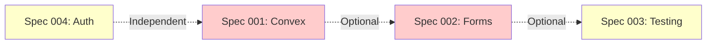

# Active Specifications - Standards Compliance

**Created:** 2025-11-20  
**Source:** Standards Compliance Audit  
**Total Specs:** 4  
**Estimated Total Time:** 10-13 days sequential | 28-35 hours parallel (3-4x speedup)

---

## Overview

This directory contains executable specifications for fixing critical standards compliance issues identified in the audit report (`.factory/memory/org/standards-compliance-audit.md`) **PLUS** performance optimizations discovered from convex-helpers analysis.

All specs are:
- ✅ **Research-backed** (MCP docs, web search, best practices, convex-helpers patterns)
- ✅ **Executable** (complete task breakdowns with code examples)
- ✅ **Parallelizable** (optimized for Droidz orchestrator)
- ✅ **Comprehensive** (requirements, architecture, edge cases, testing)

**Total Specs:** 6 (4 compliance + 2 performance)

---

## Specifications by Priority

### 📊 **Categories**
- **Standards Compliance:** Specs 001-004 (from audit report)
- **Performance Optimization:** Specs 005-006 (from convex-helpers analysis) ⚡ **NEW**

---

### 🔴 **CRITICAL (Highest Priority)**

#### **001: Migrate useState to Convex Reactive Patterns** ⚡ **ENHANCED**
- **File:** `001-convex-reactive-migration.md`
- **Addendum:** `001-ADDENDUM-convex-helpers-patterns.md` ⚡ **NEW - Better Patterns!**
- **Priority:** 🔴 CRITICAL #1
- **Impact:** Core architecture compliance
- **Scope:** Migrate 25 pages from useState to useQueryWithStatus/useMutation
- **Estimated Time:** 3-4 days sequential | 8-10 hours parallel (4x speedup)
- **Compliance Gain:** 32% → 100% (React + Convex patterns)
- **Bonus:** Use convex-helpers@0.1.104 for superior DX (already installed!)

**Why Critical:**
- Violates fundamental architecture pattern: "Use Convex reactive queries, NOT useState for server data"
- 25+ pages affected (highest volume)
- Eliminates stale data, manual state management, race conditions
- Enables real-time reactivity across application

**What You'll Fix:**
- ❌ 50+ useState calls for server data → ✅ useQuery/useMutation
- ❌ Manual loading states → ✅ Convex automatic loading
- ❌ No real-time updates → ✅ Real-time reactive data

**Parallel Execution:**
- 4 streams: Notifications/Certs, Profile/Settings, Search/Courses, Admin/Checkout
- 4 agents working simultaneously
- 4x faster completion

---

#### **002: Standardize Forms with React Hook Form + Controller**
- **File:** `002-form-standardization.md`
- **Priority:** 🔴 CRITICAL #2
- **Impact:** Form handling consistency, validation, UX
- **Scope:** Migrate 5+ major forms to FormProvider + Controller + Zod
- **Estimated Time:** 2-3 days sequential | 6-8 hours parallel (3x speedup)
- **Compliance Gain:** 20% → 100% (Form patterns)

**Why Critical:**
- Only 1 out of 5+ forms follows the required pattern
- Manual useState + onChange for every field (massive boilerplate)
- No centralized validation, no type safety
- Poor UX (no field-level errors, no accessibility)

**What You'll Fix:**
- ❌ Manual useState per field → ✅ FormProvider + Controller
- ❌ Custom validation → ✅ Zod schemas
- ❌ No type safety → ✅ TypeScript inference from Zod
- ❌ Poor accessibility → ✅ WCAG 2.1 AA compliant

**Parallel Execution:**
- 3 streams: Settings/Profile, Checkout, Instructor/Admin
- 3 agents working simultaneously
- 3x faster completion

---

### 🟡 **HIGH PRIORITY**

#### **003: Implement Frontend Testing Infrastructure**
- **File:** `003-frontend-testing.md`
- **Priority:** 🟡 HIGH #3
- **Impact:** Code quality, regression prevention, deployment confidence
- **Scope:** 0% → 80%+ frontend test coverage
- **Estimated Time:** 4-5 days sequential | 10-12 hours parallel (3x speedup)
- **Compliance Gain:** 0% → 80%+ (Frontend testing)

**Why High Priority:**
- Currently 0% frontend test coverage (0 test files)
- Backend has 100% coverage (excellent reference)
- High risk: changes can break UI without detection
- No regression protection

**What You'll Build:**
- ✅ React Testing Library setup
- ✅ 40-60 component unit tests
- ✅ 5-10 custom hook tests
- ✅ 10-15 integration tests
- ✅ CI/CD pipeline with coverage enforcement

**Parallel Execution:**
- 3 streams: UI Components, Form Components, Hooks/Pages
- 3 agents working simultaneously
- 3x faster completion

---

### 🟡 **MEDIUM PRIORITY**

#### **004: Audit and Implement Auth Protection**
- **File:** `004-auth-protection.md`
- **Priority:** 🟡 MEDIUM #4
- **Impact:** Security, access control, data protection
- **Scope:** Audit and protect all routes with Clerk auth
- **Estimated Time:** 1 day sequential | 4-5 hours parallel (2x speedup)
- **Compliance Gain:** Unknown → 100% (Auth protection)

**Why Medium Priority:**
- Security critical but backend already protected (Convex auth)
- Unknown frontend route protection coverage
- Relatively quick fix with clear patterns
- Smaller scope than other specs

**What You'll Implement:**
- ✅ Auth checks in all protected Server Components
- ✅ Clerk middleware for route groups
- ✅ Role-based access control (instructor, admin)
- ✅ Enrollment checks for course content
- ✅ Reusable auth utilities

**Parallel Execution:**
- 2 streams: Server Component auth checks, Middleware config
- 2 agents working simultaneously
- 2x faster completion

---

## Execution Order Recommendations

### Option 1: Sequential by Priority (Safest)
```
Week 1: Spec 001 (Convex migration)
Week 2: Spec 002 (Form standardization)
Week 3-4: Spec 003 (Frontend testing)
Week 4: Spec 004 (Auth protection)

Total: ~4 weeks
```

### Option 2: Parallel (Fastest) ⚡ **RECOMMENDED**
```
Week 1: 
  - Spec 001 (4 agents) - 8-10 hours
  - Spec 002 (3 agents) - 6-8 hours
  Total: ~16-18 hours (2-3 days)

Week 2:
  - Spec 003 (3 agents) - 10-12 hours
  - Spec 004 (2 agents) - 4-5 hours
  Total: ~14-17 hours (2 days)

Total: ~4-5 days (vs 4 weeks sequential)
```

### Option 3: Hybrid (Balanced)
```
Week 1: Spec 001 (parallel execution) - 2 days
Week 2: Spec 002 + 004 (parallel) - 2 days
Week 3: Spec 003 (parallel execution) - 2 days

Total: ~2 weeks
```

---

## Compliance Impact Summary

| Metric | Before | After Spec 001 | After Spec 002 | After Spec 003 | After Spec 004 | Final |
|--------|--------|----------------|----------------|----------------|----------------|-------|
| React + Convex Patterns | 32% | ✅ 100% | 100% | 100% | 100% | **100%** |
| Form Patterns | 20% | 20% | ✅ 100% | 100% | 100% | **100%** |
| Frontend Tests | 0% | 0% | 0% | ✅ 80%+ | 80%+ | **80%+** |
| Auth Protection | ❓ Unknown | Unknown | Unknown | Unknown | ✅ 100% | **100%** |
| **Overall Compliance** | **70%** | **78%** | **85%** | **92%** | **95%+** | **95%+** |

---

## How to Execute

### Using Droidz Orchestrator (Recommended)

**Execute All Specs in Parallel:**
```bash
"Use orchestrator to implement all active specs in .factory/specs/active/ directory"
```

**Execute Single Spec:**
```bash
"Use orchestrator to implement Spec 001 (Convex reactive migration)"
"Use orchestrator to implement Spec 002 (Form standardization)"
"Use orchestrator to implement Spec 003 (Frontend testing)"
"Use orchestrator to implement Spec 004 (Auth protection)"
```

**Review Spec First:**
```bash
"Show me the execution plan for Spec 001"
"What tasks are in Spec 002?"
```

### Manual Execution

1. Read the spec thoroughly
2. Follow Phase 1 (Foundation) sequentially
3. Execute Phase 2 (Parallel tasks) with team
4. Complete Phase 3 (Integration/Testing) sequentially

---

## Dependencies Between Specs



**Key:**
- **Solid lines:** Hard dependency (must run after)
- **Dotted lines:** Soft dependency (better UX if ordered, but can run independently)

**Execution Flexibility:**
- ✅ Specs 001, 003, 004 can run in parallel (no dependencies)
- ✅ Spec 002 works best after Spec 001 (forms will use Convex mutations)
- ✅ Spec 003 can run anytime (tests verify other specs)

---

## Success Criteria

**All Specs Complete When:**
- [ ] All 4 spec acceptance criteria met
- [ ] Overall compliance: 95%+
- [ ] `bun verify` passes (format + lint + typecheck + test coverage)
- [ ] All tests passing (backend + frontend)
- [ ] No ESLint warnings
- [ ] No TypeScript errors
- [ ] No security vulnerabilities
- [ ] Real-time reactivity working
- [ ] Forms accessible and validated
- [ ] Auth protection verified

---

## Research & Validation

All specs were created using:
- ✅ MCP Documentation Search (Next.js, Convex, React Hook Form, Clerk)
- ✅ Web Search (2025 best practices, modern patterns)
- ✅ Existing codebase analysis (standards, working examples)
- ✅ OWASP security guidelines
- ✅ WCAG accessibility standards

**Research Sources:**
- Convex React Docs
- React Hook Form official docs
- React Testing Library guides
- Clerk Next.js integration docs
- Next.js 16 best practices articles
- Modern testing strategies (2025)

---

## Questions?

**For Spec Details:**
- Read the individual spec markdown files
- Each spec has complete architecture diagrams, code examples, edge cases

**For Execution Help:**
- See `.factory/DROIDZ_SETUP.md` for orchestrator usage
- See `.factory/memory/org/standards-compliance-audit.md` for audit context

**For Implementation:**
- Use Droidz orchestrator for parallel execution (fastest)
- Or execute manually with your team
- Follow testing strategies in each spec

---

**Ready to Start?**

```bash
# Review all specs
ls .factory/specs/active/

# Execute compliance specs with orchestrator (recommended)
"Use orchestrator to implement Spec 001 in parallel"

# Execute performance specs
"Use orchestrator to implement Spec 005 in parallel"

# Or execute all at once (aggressive, requires coordination)
"Use orchestrator to implement all 6 specs with maximum parallelization"
```

---

## 🆕 NEW Performance Specs (Discovered from convex-helpers)

### Spec 005: Optimize N+1 Queries ⚡

**File:** `005-optimize-n+1-queries.md`

**Impact:** 2-10x performance improvement on complex queries

**Found 15+ N+1 Patterns:**
- `enrollments.ts`: 4 instances (571 queries → ~100 for 10 enrollments!)
- `courses.ts`: 2 instances
- `analytics.ts`: 2 instances
- `recommendations.ts`, `favorites.ts`, `notifications.ts`: 1 each

**Solution:** Use relationship helpers from convex-helpers:
- `asyncMap` for clearer parallel operations
- `getManyFrom` for one-to-many relationships
- Batch reading for better performance

**Estimated:** 1-2 days sequential | 4-6 hours parallel

---

### Spec 006: Auth Middleware with Custom Functions ⚡

**File:** `006-auth-middleware-custom-functions.md`

**Impact:** 75% code reduction, DRY principle, better maintainability

**Found Repetitive Auth Pattern in 10+ Files:**
- Same auth logic copy-pasted everywhere
- 200+ lines of boilerplate
- Change auth = update 10+ files

**Solution:** Custom query/mutation builders:
- `queryWithUser` - optional auth
- `queryWithAuthUser` - required auth
- `mutationWithUser` - required auth
- `queryWithInstructor` - role-based

**Estimated:** 1 day sequential | 3-4 hours parallel

---

## Updated Execution Plan

**All 6 Specs Together:**
- **Sequential:** 12-15 days
- **Parallel (Orchestrated):** 35-45 hours
- **Speedup:** 3-4x faster ⚡

**Recommended Order:**
1. **Spec 001** (Critical - useState → Convex)
2. **Spec 005** (High - N+1 optimization) ← Can run in parallel with 001!
3. **Spec 002** (Critical - Forms)
4. **Spec 003** (High - Testing)
5. **Spec 006** (Medium - Auth middleware)
6. **Spec 004** (Medium - Auth protection)

---

*All 6 specs are research-backed, executable, and optimized for parallel execution. Total estimated time: 12-15 days sequential → 35-45 hours parallel (3-4x speedup).*
